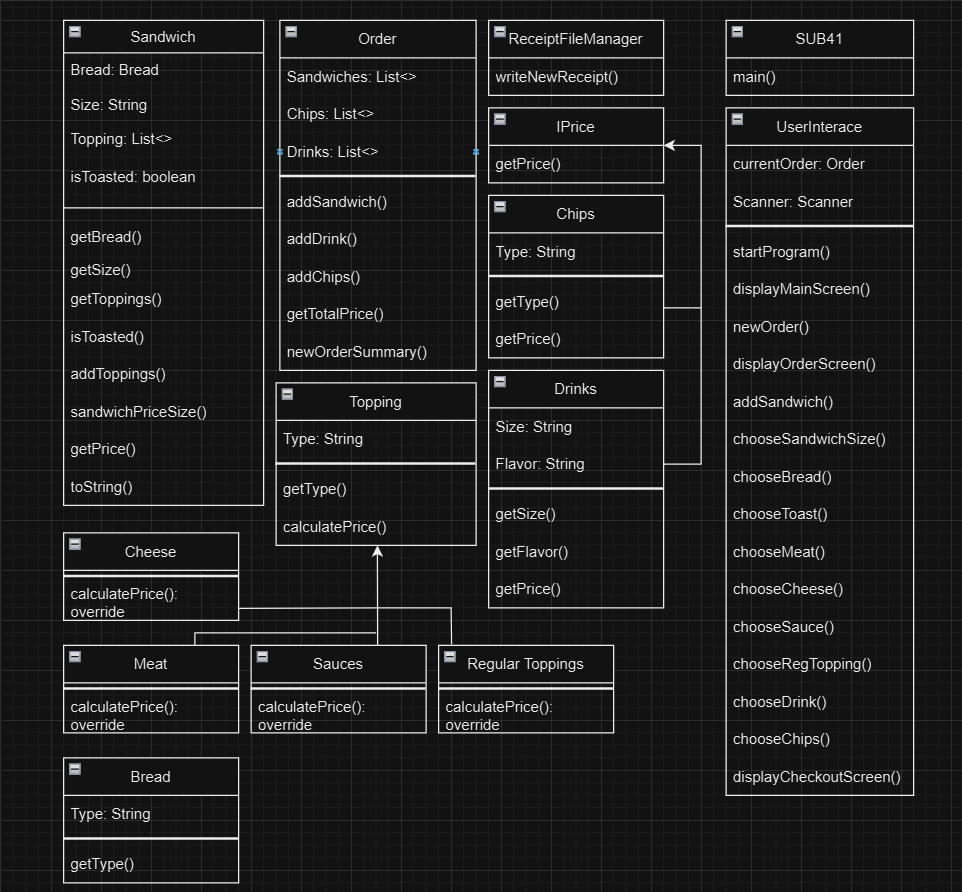
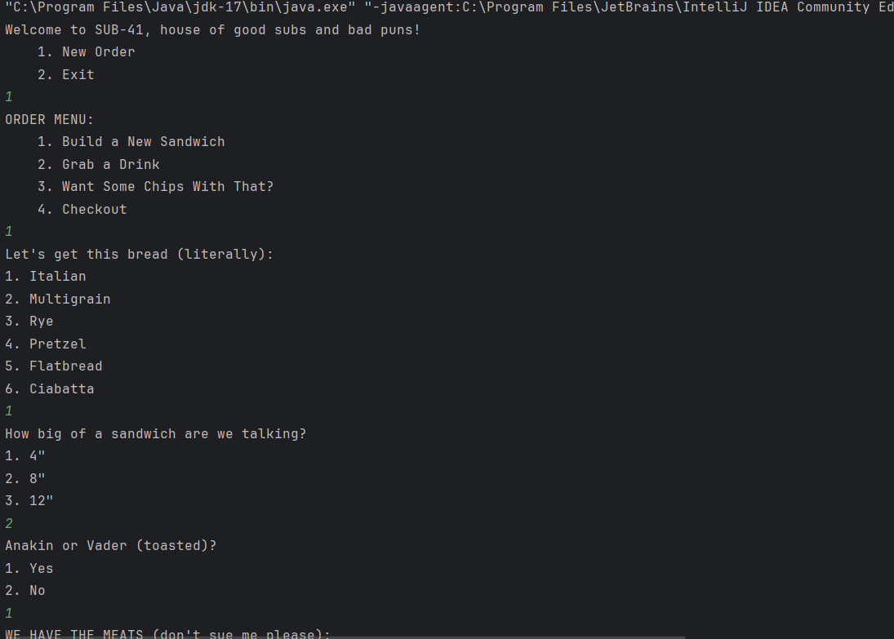
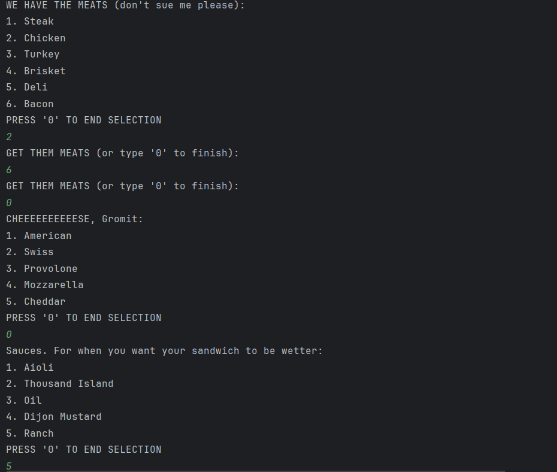
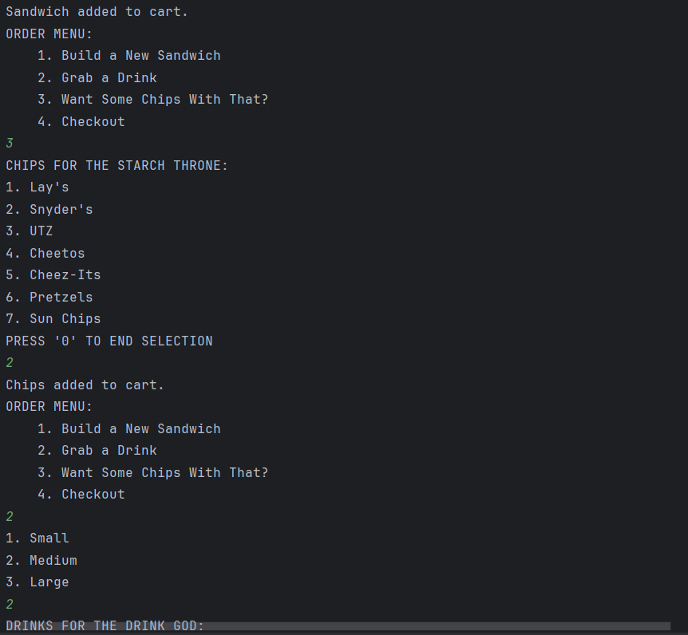
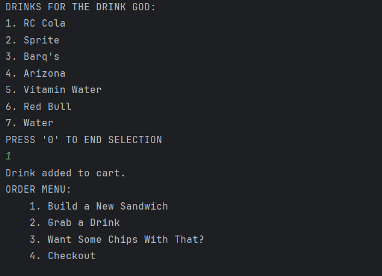
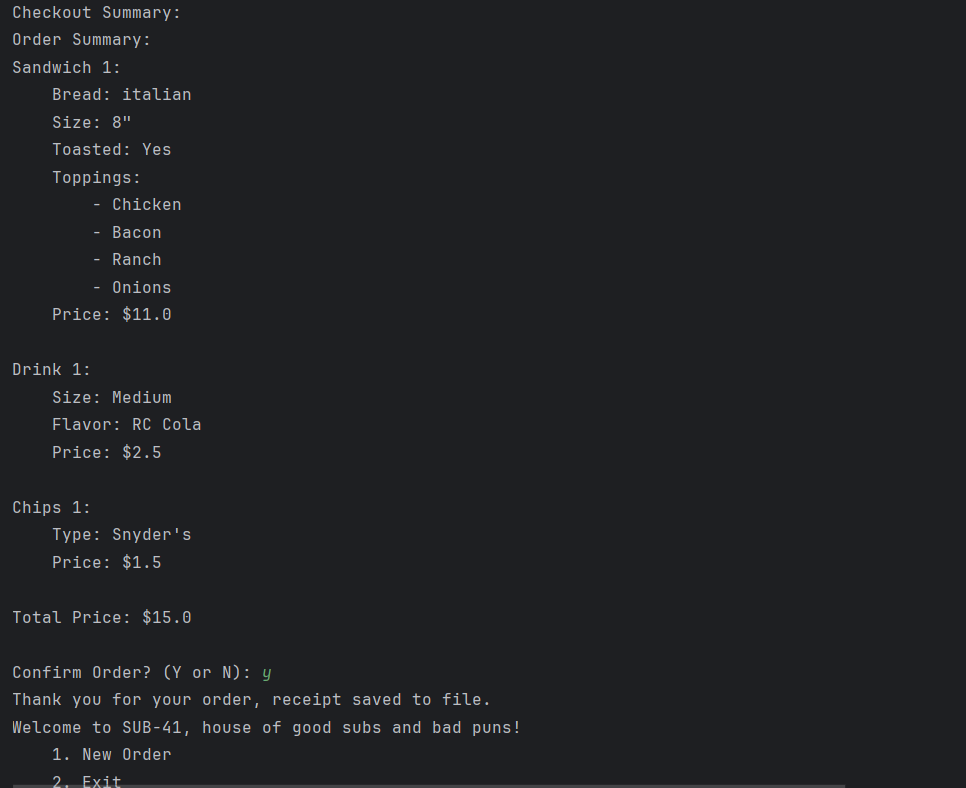

# SUB-41

## Description of the Project

SUB-41 is a sandwich shop application, that allows users to order a sandwich (plus extras), mimicking a real life ordering kiosk. Users are able to build 1 or more sandwiches, add drinks and chips, and check out, ultimately saving the receipt to a new file after every transaction.

#### Class Diagram

## User Stories

- As a User, I want to be able to input my data, so that the application can process it accordingly.
- As a User, I want to receive immediate feedback, so I can understand what to do next.
- As a User, I want to be able to navigate a welcoming User Interface, so that I may have a good user experience when ordering my food.
- As a User, I want to be able to add a variety of toppings to my sandwich, so that I may have exactly what I want to eat.
- As a User, I want to have the option to add extras, like drinks and chips to my order, so that I can have a full meal.
- As a User, I want the ability to add multiples of every item, so that I can order food for multiple people if need be.
- As a User, I want to be able to cancel my order and start over or exit, so that I can change my mind if I want to.
- As an Owner, I want each receipt to be saved as its own file, so that I can keep track of transactions and do file management behind the scenes.

## Setup

Instructions on how to set up and run the project using IntelliJ IDEA.

### Prerequisites

- IntelliJ IDEA: Ensure you have IntelliJ IDEA installed, which you can download from [here](https://www.jetbrains.com/idea/download/).
- Java SDK: Make sure Java SDK is installed and configured in IntelliJ.

### Running the Application in IntelliJ

Follow these steps to get your application running within IntelliJ IDEA:

1. Open IntelliJ IDEA.
2. Select "Open" and navigate to the directory where you cloned or downloaded the project.
3. After the project opens, wait for IntelliJ to index the files and set up the project.
4. Find the main class with the `public static void main(String[] args)` method.
5. Right-click on the file and select 'Run 'SUB41.main()'' to start the application.

## Technologies Used

- Java: JDK 17

## Demo

#### Ordering the Sandwich

#### Adding Chips and Drink

#### Order Summary

## Future Work

Here's a few ideas I have for future additions:

- Adding Specialty Sandwiches that are pre-built.
- Putting each submenu into their own classes to clean up the UI.
- Converting the idea of a sandwich shop into other contexts (other restaurants, theaters, etc...)

## Resources

- Stack Overflow
- w3schools

## Thanks

- Thank you to Raymond for continuous support and guidance.
- My brain, for eventually doing what I very much needed it to do.